## ***Activité Pratique N°4 :  Sécurité des Systèmes Distribués*** 

### ***Objectifs*** 🎯
**Partie 1** :
1. Télécharger Keycloak 23.0.1
2. Démarrer Keycloak
3. Créer un compte Admin
4. Créer une Realm
5. Créer un client à sécuriser
6. Créer des utilisateurs
7. Créer des rôles
8. Affecter les rôles aux utilisateurs
9. Avec PostMan :
    - Tester l'authentification avec le mot de passe
    - Analyser les contenus des deux JWT Access Token et Refresh Token
    - Tester l'authentification avec le Refresh Token
    - Tester l'authentification avec Client ID et Client Secret
    - Changer les paramètres des Tokens Access Token et Refresh Token

**Partie  2** :
-Sécuriser avec Keycloak les applications Wallet App

## ***Partie 1*** 
***Keycloak*** est un serveur d'authentification et d'autorisation Open Source. Il permet de gérer les utilisateurs, les rôles, les groupes, les sessions, les politiques de sécurité, etc. Il est basé sur le standard OpenID Connect et s'appuie sur le standard OAuth 2.0. Il est compatible avec les standards SAML 2.0 et LDAP.

***Quarkus*** est un framework Java open source, conçu pour créer des applications Java natives et efficaces pour le cloud. Il est basé sur des normes Java bien établies et largement adoptées, notamment Eclipse MicroProfile, Hibernate et Apache Camel via une architecture réactive.
#### 1. Télécharger Keycloak
- Télécharger Keycloak depuis le site officiel : https://www.keycloak.org/downloads.html

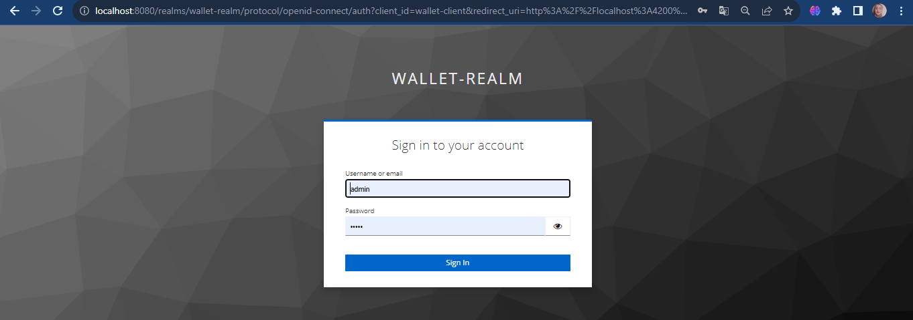
- Décompresser le fichier téléchargé
- Se placer dans le répertoire bin de Keycloak

#### 2. Démarrer Keycloak
- Lancer Keycloak avec la commande : `docker run -p 8080:8080 -e KEYCLOAK_ADMIN= -e KEYCLOAK_ADMIN_PASSWORD= quay.io/keycloak/keycloak:23.0.1 start-dev`

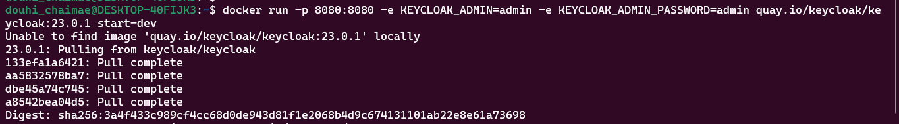
- Keycloak est accessible à l'adresse : http://localhost:8080

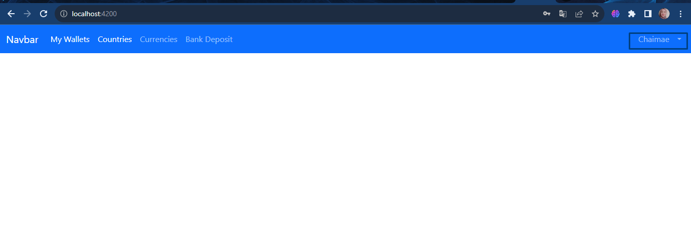
- Se connecter avec le compte Admin créé lors de l'installation

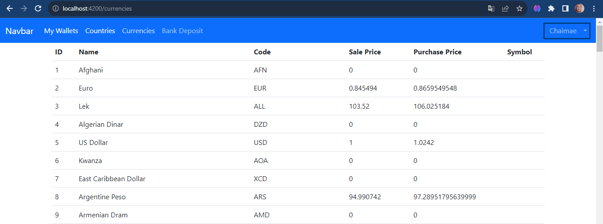

#### 3. Créer un Realm

Un **Realm** est un espace de travail qui regroupe des utilisateurs, des applications, des rôles, des groupes, des politiques de sécurité, etc. Il est possible de créer plusieurs Realms. Par exemple, un Realm pour les utilisateurs, un Realm pour les applications, etc.

- Créer un Realm en cliquant sur le bouton Add realm
- Donner un nom au Realm : `wallet-realm`

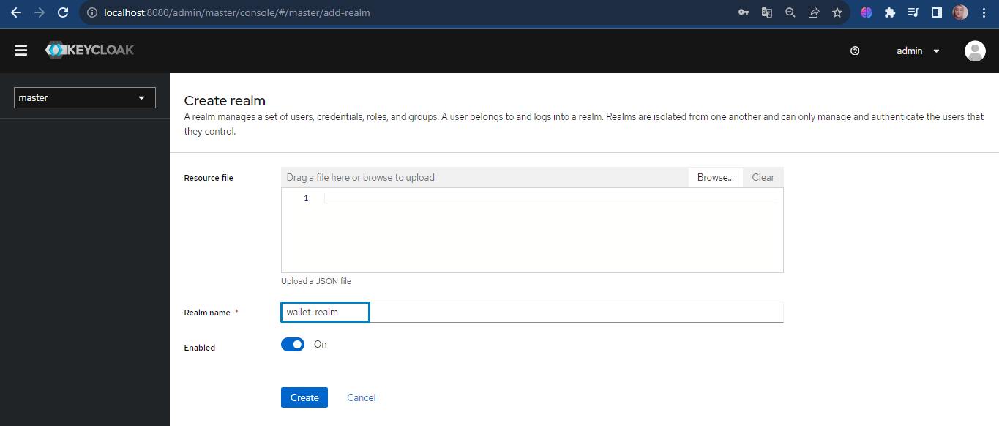

#### 4. Créer un client à sécuriser

Un **client** est une application qui va être sécurisée par Keycloak. Il peut s'agir d'une application Web, d'une application mobile, d'une API, etc.

- Créer un client
- Donner un nom au client : `wallet-client`

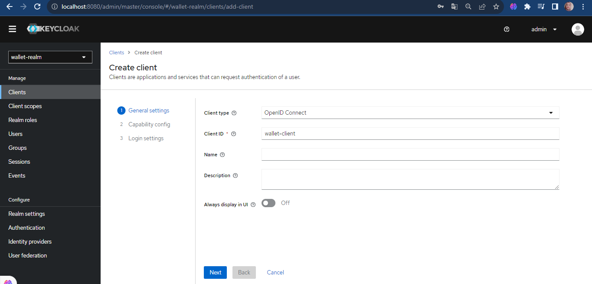
- Choisir l'option Confidential

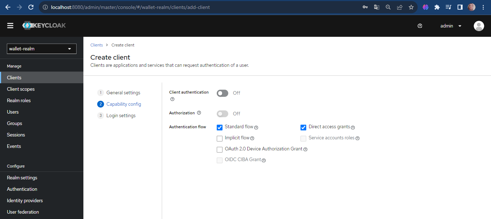

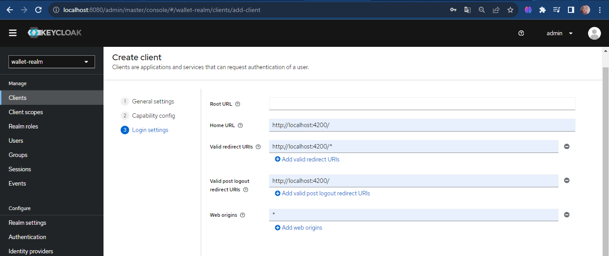

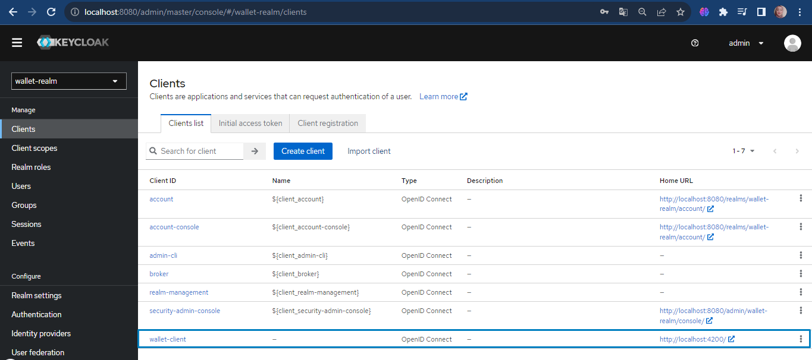

#### 5. Créer des utilisateurs

Les **utilisateurs** sont les personnes qui vont utiliser les applications sécurisées par Keycloak.

- Créer un utilisateur
- Donner un nom à l'utilisateur : `douhichaimae`
- Donner un email à l'utilisateur : `chaimaedouhi7@gmail.com`
- Activer l'utilisateur

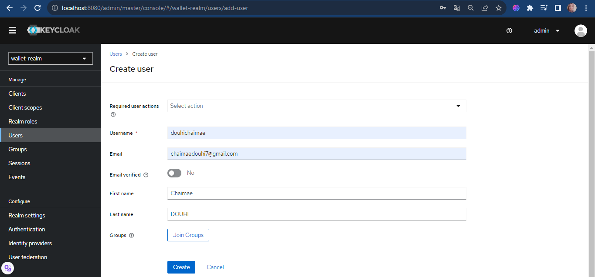
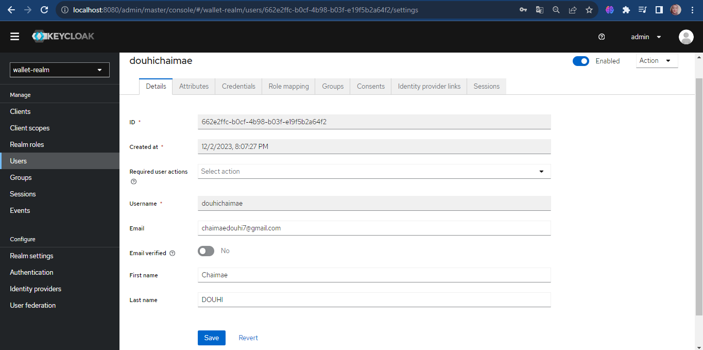

- Créer un mot de passe pour l'utilisateur

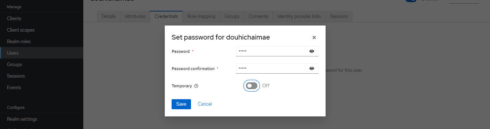
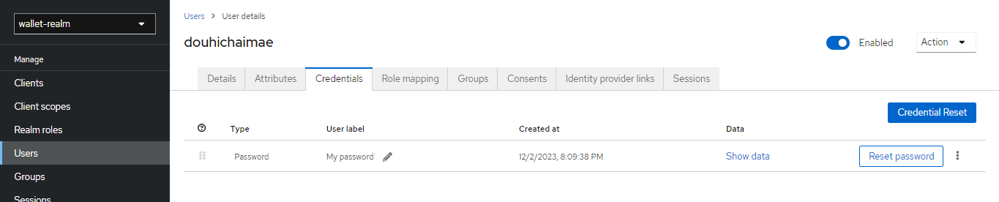

#### 6. Créer des rôles

Les **rôles** sont des permissions qui vont être affectées aux utilisateurs. Par exemple, un utilisateur peut avoir le rôle `user` et un autre utilisateur peut avoir le rôle `admin`.

- Créer un rôle
- Donner un nom au rôle : `user`
- Sauvegarder le rôle

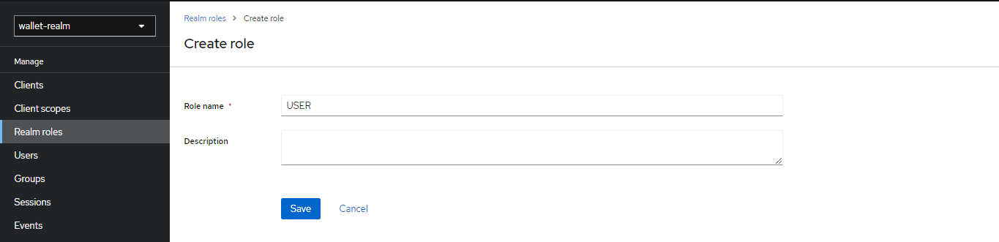
- Créer un autre rôle
- Donner un nom au rôle : `admin`
- Sauvegarder le rôle

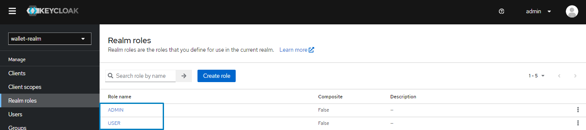

#### 7. Affecter les rôles aux utilisateurs
Dans **Role Mappings**, affecter le rôle `admin` à l'utilisateur `douhichaimae`

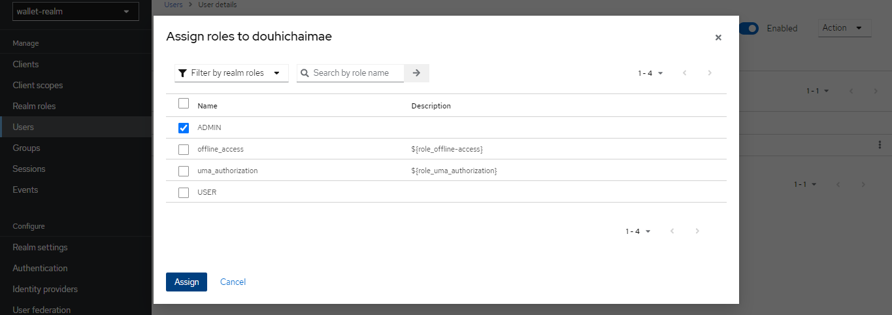

#### 8. Avec PostMan :
##### Tester l'authentification avec le mot de passe
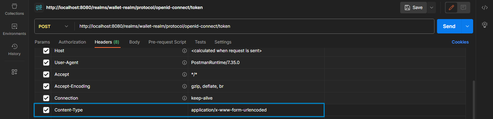
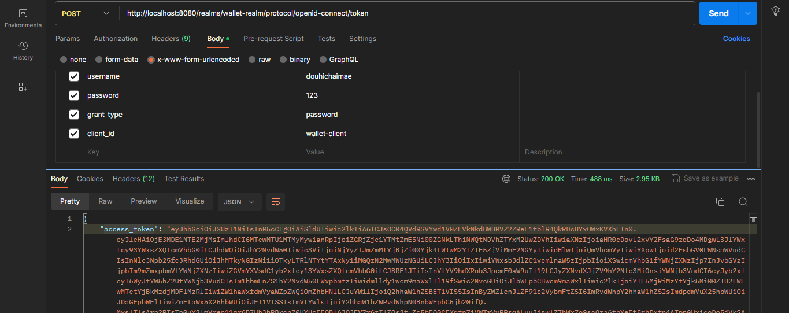

* Access Token: JWT qui contient les informations de l'utilisateur authentifié
* Refresh Token: JWT qui permet de générer un nouveau Access Token sans avoir à s'authentifier à nouveau
* Expires In: Durée de validité du Access Token en secondes
* Refresh Expires In: Durée de validité du Refresh Token en secondes
* Session State: Identifiant de la session de l'utilisateur
* Scope: Permissions de l'utilisateur
* Token Type: Type du token (ici Bearer)

Le token se présente sous la forme suivante : `header.payload.signature`

* Header: Contient le type du token et l'algorithme de signature
* Payload: Contient les informations de l'utilisateur authentifié
* Signature: Permet de vérifier l'intégrité du token 


##### Analyser les contenus des deux JWT Access Token et Refresh Token
- Analyser le contenu du Access Token sur le site https://jwt.io/

***HEADER***
```json
{
   "alg": "RS256",
   "typ": "JWT",
   "kid": "l8-8AWQIV0wUtdEd6GAXtUgfQxMmnTxBDCqF19lJUxE"
}
```

***PAYLOAD***
```json
{
   "exp": 1701551623,
   "iat": 1701551323,
   "jti": "ddcf75a3-fa96-4dcd-8b5d-45ae613e0d5a",
   "iss": "http://localhost:8080/realms/wallet-realm",
   "aud": "account",
   "sub": "662e2ffc-b0cf-4b98-b03f-e19f5b2a64f2",
   "typ": "Bearer",
   "azp": "wallet-client",
   "session_state": "a1924b36-b992-4e56-a017-b0d37c01e34e",
   "acr": "1",
   "allowed-origins": [
      "*"
   ],
   "realm_access": {
      "roles": [
         "offline_access",
         "default-roles-wallet-realm",
         "ADMIN",
         "uma_authorization"
      ]
   },
   "resource_access": {
      "account": {
         "roles": [
            "manage-account",
            "manage-account-links",
            "view-profile"
         ]
      }
   },
   "scope": "email profile",
   "sid": "a1924b36-b992-4e56-a017-b0d37c01e34e",
   "email_verified": false,
   "name": "Chaimae DOUHI",
   "preferred_username": "douhichaimae",
   "given_name": "Chaimae",
   "family_name": "DOUHI",
   "email": "chaimaedouhi7@gmail.com"
}
```
***Signature***

`Signature = HMACSHA256(base64UrlEncode(header) + "." + base64UrlEncode(payload), secret)`

- Analyser le contenu du Refresh Token sur le site https://jwt.io/

***HEADER***
```json
{
   "alg": "HS256",
   "typ": "JWT",
   "kid": "6e7a2f70-b794-4e02-8eb3-a29642b61014"
}
```

***Payload***
```json
{
   "exp": 1701553123,
   "iat": 1701551323,
   "jti": "1ac7de38-e1e6-4589-94c1-1a3e79c0932f",
   "iss": "http://localhost:8080/realms/wallet-realm",
   "aud": "http://localhost:8080/realms/wallet-realm",
   "sub": "662e2ffc-b0cf-4b98-b03f-e19f5b2a64f2",
   "typ": "Refresh",
   "azp": "wallet-client",
   "session_state": "a1924b36-b992-4e56-a017-b0d37c01e34e",
   "scope": "email profile",
   "sid": "a1924b36-b992-4e56-a017-b0d37c01e34e"
}
```
***Signature***

`Signature = HMACSHA256(base64UrlEncode(header) + "." + base64UrlEncode(payload), secret)`

##### Tester l'authentification avec le Refresh Token
- Récupérer le Refresh Token du précédent test

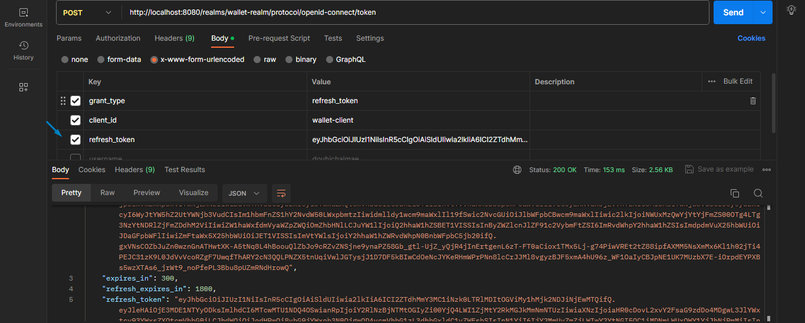
Dans ce cas, le Access Token est généré à partir du Refresh Token, sans avoir à s'authentifier à nouveau.

##### Tester l'authentification avec Client ID et Client Secret
- Récupérer le Client ID et le Client Secret
On peut récupérer le Client ID et le Client Secret dans l'onglet Credentials du client

* On va activer l'option Client Autentication et Service Accounts roles

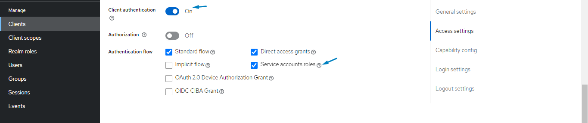
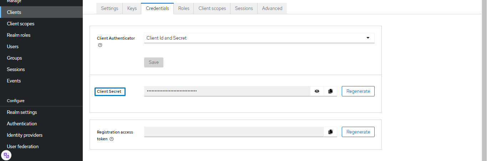
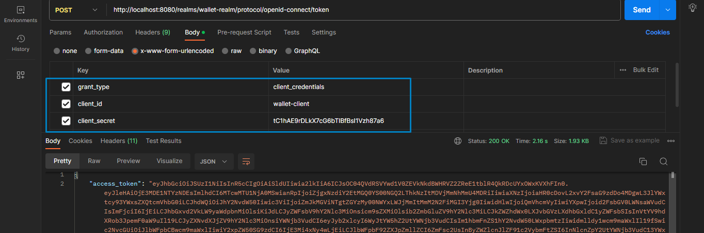

##### Changer les paramètres des Tokens Access Token et Refresh Token
- Dans l'onglet Settings du Realm, on peut changer les paramètres des Tokens Access Token et Refresh Token
- On peut changer la durée de validité des Tokens Access Token et Refresh Token

## ***Partie 2 : Sécuriser avec Keycloak les applications Wallet App***
 
Dans cette partie, on va sécuriser les applications Wallet App avec Keycloak. On va utiliser le protocole OpenID Connect pour sécuriser les applications Wallet App. On va utiliser le client wallet-client créé dans la partie précédente.


